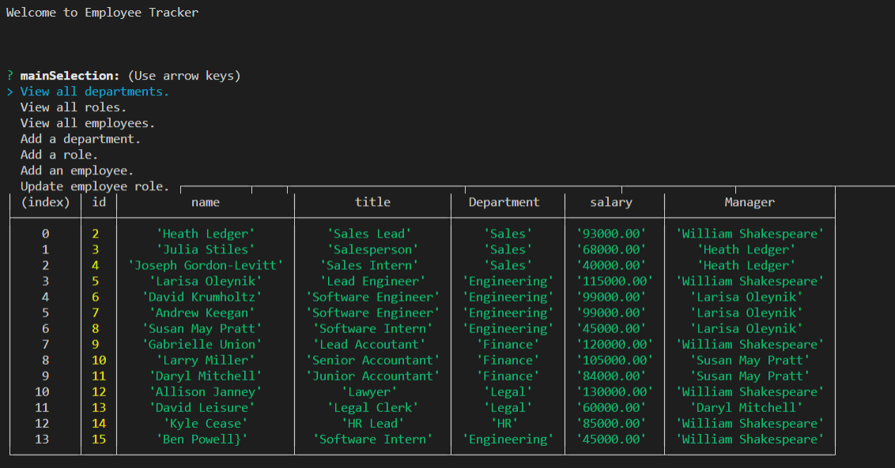

  # Employee Tracker

## Badges

## Description

A Command Line database system to keep track of your business's employee information.

## Table of Contents

- [Badges](#Badges)
- [Installation](#installation)
- [Usage](#usage)
- [Credits](#credits)
- [License](#license)
- [Tests](#tests)

## Installation

- Run npm i to packe sure all dependencies are loaded. Run in comand line with 'node index.'

## Usage

Use the menu to choose what table to view, what role or department to add, what employee to add, or what employee to update.

- [Video of app demonstration](https://watch.screencastify.com/v/T19UgOS7KZHQVQgBhdWn)

## Credits

- [powe0186](https://github.com/powe0186)

## License

### MIT

    MIT License:
    A short and simple permissive license with conditions only requiring preservation
    of copyright and license notices. Licensed works, modifications, and larger works
    may be distributed under different terms and without source code.

[CLICK FOR MORE ABOUT LICENSE](https://choosealicense.com/licenses/mit/)

## Tests

npm test.

## My Github & Email

- [https://github.com/powe0186](https://github.com/powe0186)
- [powe0186@gmail.com](mailto:powe0186@gmail.com)

